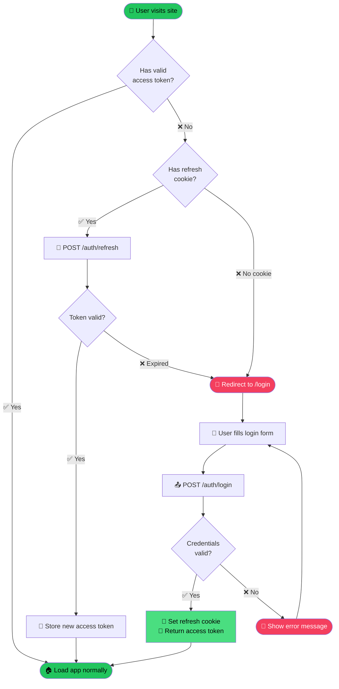
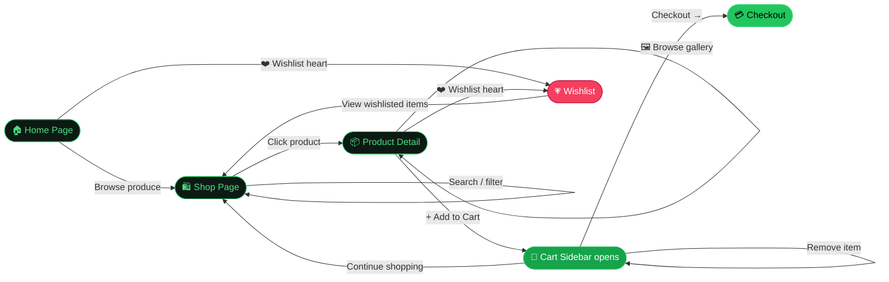
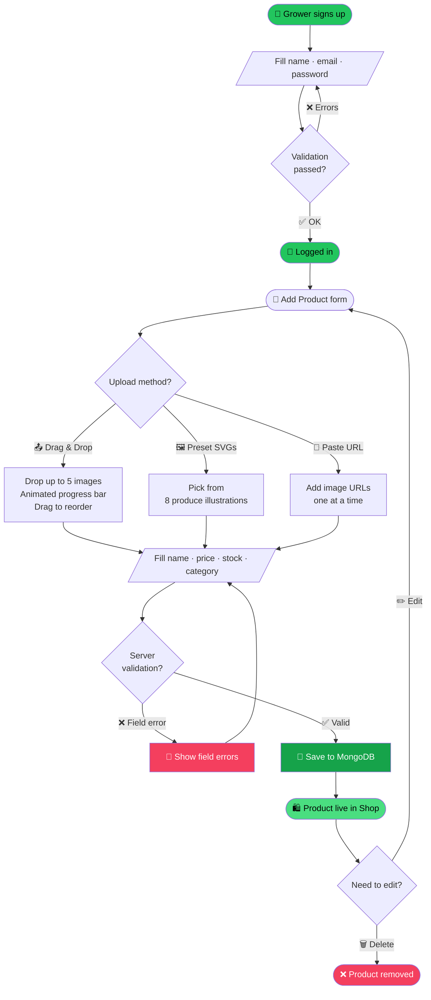
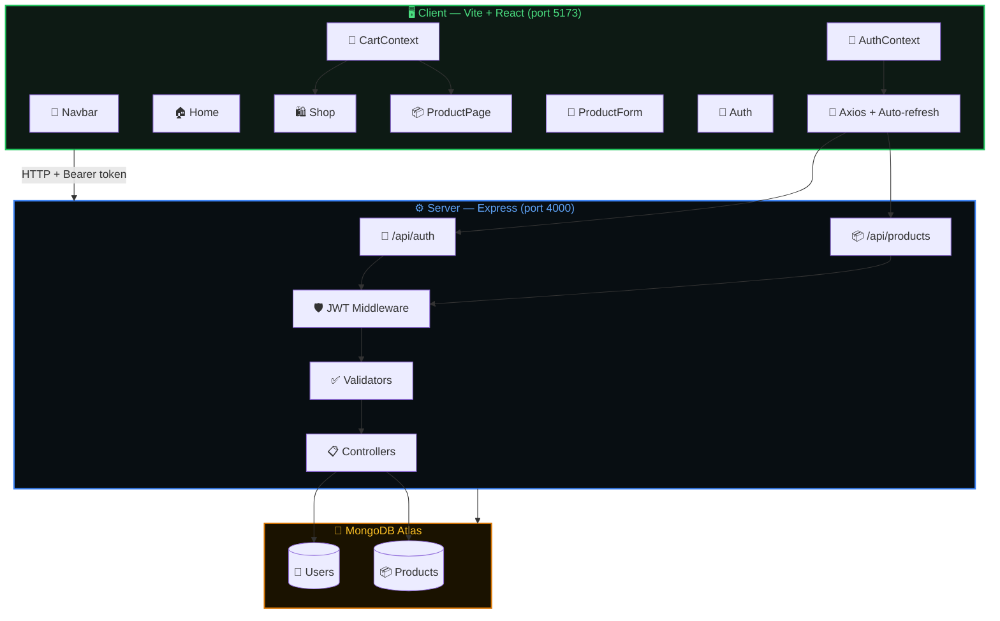
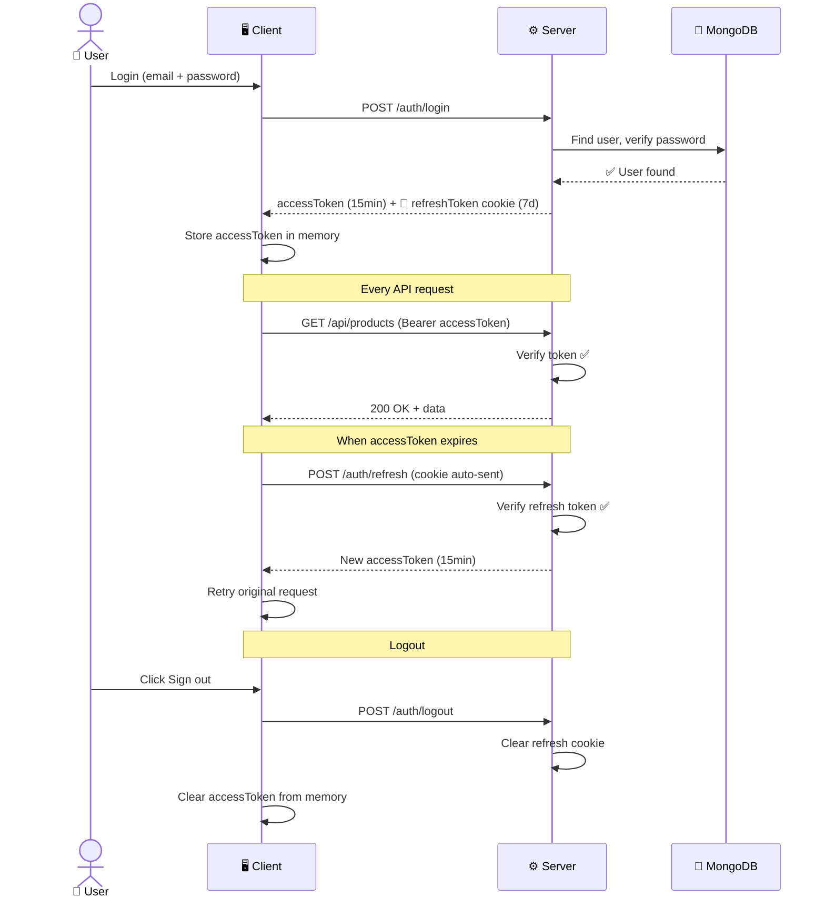

<div align="center">

# 🌿 GreenCart

### *Farm-direct produce from the Konkan coast to your door*

[](https://react.dev)
[](https://nodejs.org)
[](https://mongodb.com)
[](https://expressjs.com)
[](https://vitejs.dev)

[](LICENSE)
[](https://github.com/Prem759-0/curd-ecomm/pulls)
[](https://github.com/Prem759-0/curd-ecomm/stargazers)

---

> 🥭 **Mangoes** · 🌿 **Herbs** · 🥥 **Coconuts** · 🌶️ **Kokum** · 🍋 **Turmeric**
> 
> *Zero middlemen. Fair prices. Picked this week.*

---

</div>

## 📸 Preview

| 🏠 Home — Hero & Stats | 🛍️ Shop — Product Grid |
|:---:|:---:|
| Animated hero banner with floating badges | Dark-theme grid with hover overlays |

| 📦 Product Page — Image Gallery | 📝 Add Product — Drag & Drop |
|:---:|:---:|
| Prev/next arrows · thumbnails · dot indicators | 5-image upload with progress bar & reorder |

---

## ✨ Feature Highlights

### 🎨 Design & Animations
| Feature | Detail |
|---|---|
| 🌑 **Dark premium theme** | Deep `#080e12` base with glassmorphism cards |
| 🔤 **Custom fonts** | *Playfair Display* (hero) + *Space Grotesk* (body) |
| 🌊 **Ambient orbs** | Floating radial gradient blobs behind every page |
| ⚡ **Scroll reveal** | Sections animate up as you scroll into view |
| 🔄 **Page loader** | Spinning ring fades out after content loads |
| 💀 **Skeleton loader** | Shimmer cards while products are fetching |
| 🏷️ **Ticker banner** | Infinite-scroll produce announcements |
| 🦸 **Hero text rise** | Words slide up on load with staggered delay |
| 🎯 **Gradient text** | Hero accent animates green → lime → amber |

### 🛒 E-commerce
| Feature | Detail |
|---|---|
| 🛒 **Cart sidebar** | Slides in from right with item list, qty controls, total |
| ❤️ **Wishlist** | Toggle hearts on any product, persists per session |
| ⭐ **Quick add** | "Add to cart" button appears on tile hover |
| 🔢 **Qty selector** | +/− controls on product detail page |
| 🖼️ **Multi-image** | Up to **5 images** per product with drag-to-reorder |
| 🖱️ **Drag & drop** | Drop zone with animated progress bar |
| 📸 **Image gallery** | Prev/next arrows, thumbnail strip, dot indicators |
| 📋 **Live preview** | See product card update as you type in the form |

### 🔐 Auth & Security
| Feature | Detail |
|---|---|
| 🔑 **JWT Auth** | Short-lived access tokens (15 min) + refresh tokens (7 days) |
| 🍪 **HttpOnly cookies** | Refresh tokens stored securely, never in JS |
| 👤 **Protected routes** | Add/edit products only when signed in |
| 🛡️ **Ownership check** | Edit/delete only your own listings |
| ✅ **Input validation** | Server-side validation on all routes (express-validator) |

---

## 🗂️ Project Structure

```
greencart/
│
├── 📁 client/                     # React + Vite frontend
│   ├── 📁 public/
│   │   └── 📁 products/           # SVG produce illustrations
│   │       ├── mango.svg
│   │       ├── drumstick.svg
│   │       ├── kokum.svg
│   │       └── ...
│   ├── 📁 src/
│   │   ├── 📁 components/
│   │   │   ├── 🧭 Navbar.jsx      # Sticky nav with cart badge
│   │   │   ├── 🛒 CartSidebar.jsx # Slide-in cart drawer
│   │   │   ├── 🃏 ProductTile.jsx  # Card with wishlist & quick-add
│   │   │   ├── ✏️  Field.jsx       # Reusable form field
│   │   │   ├── 🍊 Hero3D.jsx      # Three.js 3D fruit scene
│   │   │   └── ⚙️  OwnerActions.jsx
│   │   ├── 📁 pages/
│   │   │   ├── 🏠 Home.jsx        # Landing page (8 sections)
│   │   │   ├── 🛍️  Shop.jsx        # Product grid with search/filter
│   │   │   ├── 📦 ProductPage.jsx # Detail page with image gallery
│   │   │   ├── 📝 ProductForm.jsx # Add/edit with drag-drop images
│   │   │   └── 🔐 Auth.jsx        # Login / Register
│   │   ├── 🎨 styles.css          # All design tokens & components
│   │   ├── 🔗 api.js              # Axios instance + token refresh
│   │   ├── 🔑 AuthContext.jsx     # Auth + Cart + Wishlist state
│   │   └── ⚛️  main.jsx
│   ├── vite.config.js
│   └── package.json
│
├── 📁 server/                     # Express + MongoDB API
│   ├── 📁 src/
│   │   ├── 📁 controllers/
│   │   │   ├── 🔐 auth.js         # Register, login, logout, refresh, me
│   │   │   └── 📦 product.js      # CRUD for products
│   │   ├── 📁 middleware/
│   │   │   ├── 🛡️  authenticate.js # JWT verification middleware
│   │   │   └── ✅ validate.js     # express-validator error handler
│   │   ├── 📁 models/
│   │   │   ├── 👤 User.js         # name, email, passwordHash
│   │   │   └── 📦 Product.js      # name, price, stock, images[], ...
│   │   ├── 📁 routes/
│   │   │   ├── 🔐 auth.js
│   │   │   └── 📦 product.js
│   │   ├── ✅ validators.js       # All validation rule sets
│   │   ├── 🌱 seed.js             # Demo data seeder
│   │   └── 🚀 index.js            # Express app entry
│   ├── .env.example
│   └── package.json
│
├── .gitignore
└── 📄 README.md
```

---

## 🔄 Application Flow

### 🔐 Authentication Flow



---

### 🛒 Shopping Flow



---

### 📦 Product Listing Flow (Seller)



---

### 🏗️ System Architecture



---

### 🔑 JWT Token Lifecycle



---

## 🛠️ Tech Stack

<div align="center">

| Layer | Technology | Purpose |
|:---:|:---:|:---|
| ⚛️ | **React 18** | UI components & routing |
| ⚡ | **Vite 5** | Dev server & bundler |
| 🎨 | **Vanilla CSS** | All styling (no Tailwind) |
| 🔤 | **Playfair Display** | Hero display font |
| 🔤 | **Space Grotesk** | Body & UI font |
| 🍊 | **Three.js** | 3D fruit in hero scene |
| 🔗 | **Axios** | HTTP client with interceptors |
| 🧭 | **React Router v6** | Client-side routing |
| ⚙️ | **Express 4** | REST API server |
| 🍃 | **Mongoose** | MongoDB ODM |
| 🔐 | **jsonwebtoken** | JWT generation & verification |
| 🔒 | **bcryptjs** | Password hashing |
| ✅ | **express-validator** | Server-side validation |
| 🌱 | **MongoDB Atlas** | Cloud database |

</div>

---

## 🚀 Getting Started

### 📋 Prerequisites

```
✅ Node.js 18+
✅ npm 9+
✅ MongoDB Atlas account (free tier works great)
```

### 1️⃣ Clone the repo

```bash
git clone https://github.com/Prem759-0/curd-ecomm.git
cd curd-ecomm
```

### 2️⃣ Set up the Server

```bash
cd server
npm install
```

Create your `.env` file (copy from example):

```bash
cp .env.example .env
```

Edit `server/.env`:

```env
PORT=4000
NODE_ENV=development
MONGODB_URI=mongodb+srv://<user>:<password>@cluster.mongodb.net/greencart
ACCESS_TOKEN_SECRET=<generate a long random string>
REFRESH_TOKEN_SECRET=<generate a different long random string>
ACCESS_TOKEN_EXPIRES=15m
REFRESH_TOKEN_EXPIRES_DAYS=7
CLIENT_URL=http://localhost:5173
SEED_PASSWORD=demopassword123
```

Start the server:

```bash
npm run dev        # 🚀 http://localhost:4000
```

Optionally seed demo data:

```bash
npm run seed       # 🌱 Creates demo products & users
```

### 3️⃣ Set up the Client

```bash
cd ../client
npm install
npm run dev        # ⚡ http://localhost:5173
```

### ✅ You're live!

| URL | What you'll see |
|---|---|
| `http://localhost:5173` | 🏠 Home page with hero, stats, testimonials |
| `http://localhost:5173/shop` | 🛍️ Browse all products |
| `http://localhost:5173/register` | 📝 Create a grower account |
| `http://localhost:5173/login` | 🔐 Sign in |
| `http://localhost:5173/products/new` | ➕ Add a product (must be logged in) |

---

## 🌐 API Reference

### 🔐 Auth Endpoints

| Method | Route | Auth | Description |
|:---:|---|:---:|---|
| `POST` | `/api/auth/register` | ❌ | Create account |
| `POST` | `/api/auth/login` | ❌ | Login → returns accessToken |
| `POST` | `/api/auth/logout` | ❌ | Clears refresh cookie |
| `POST` | `/api/auth/refresh` | 🍪 Cookie | Get new access token |
| `GET` | `/api/auth/me` | 🔑 Bearer | Get current user |

### 📦 Product Endpoints

| Method | Route | Auth | Description |
|:---:|---|:---:|---|
| `GET` | `/api/products` | ❌ | List products (paginated, searchable) |
| `GET` | `/api/products/:id` | ❌ | Get single product |
| `POST` | `/api/products` | 🔑 Bearer | Create product |
| `PUT` | `/api/products/:id` | 🔑 Bearer | Update product (owner only) |
| `DELETE` | `/api/products/:id` | 🔑 Bearer | Delete product (owner only) |

### 🔍 Query Parameters — `GET /api/products`

```
?page=1          📄 Page number (default: 1)
?limit=12        📏 Items per page (max 50)
?search=mango    🔍 Search by product name
?category=Fruits 📂 Filter by category
```

### 📦 Product Schema

```json
{
  "name":        "Alphonso Mangoes",
  "description": "Fresh from Ratnagiri, zero pesticides",
  "price":       280,
  "stock":       50,
  "category":    "Fruits",
  "image":       "https://... (legacy single image)",
  "images":      ["https://...", "https://...", "..."],
  "createdBy":   "<userId>"
}
```

---

## 🎨 Design System

### 🎨 Color Palette

| Token | Value | Usage |
|:---:|---|---|
| `--bg` | `#080e12` | Page background |
| `--bg2` | `#0d1a14` | Section backgrounds |
| `--green` | `#22c55e` | Primary accent |
| `--lime` | `#a3e635` | Gradient end |
| `--amber` | `#fbbf24` | Highlights, ratings |
| `--rose` | `#f43f5e` | Danger, wishlist active |
| `--ink` | `#f0fdf4` | Primary text |
| `--ink-muted` | `rgba(240,253,244,0.55)` | Secondary text |

### 🔤 Typography

| Font | Weight | Used for |
|---|---|---|
| **Playfair Display** | 700–900, italic | Hero headlines |
| **Plus Jakarta Sans** | 700–900 | Section headings, h2–h4 |
| **Space Grotesk** | 300–700 | Body text, buttons, nav |

### ✨ Animation Catalogue

| Name | Duration | Effect |
|---|---|---|
| `rise` | 0.9s | Text lines slide up on load |
| `fade` | 0.8s | Opacity fade-in |
| `gradient-shift` | 4s∞ | Background position loop |
| `orb-drift` | 12s∞ | Ambient orbs float |
| `float-badge` | 4s∞ | Hero badges bob up/down |
| `shimmer` | 1.6s∞ | Skeleton loader shimmer |
| `spin` | 0.9s∞ | Page loader & button spinner |
| `pop` | 0.3s | Cart badge scale-in |
| `pulse-ring` | 3s∞ | Ring around 3D hero |
| `ticker` | 25s∞ | Horizontal news scroll |
| `drop-pulse` | 0.5s∞ | Drop zone border glow on drag |
| `loader-out` | 0.4s→ | Page loader fades out |

---

## 📄 Pages Overview

### 🏠 Home — 8 sections
```
┌─────────────────────────────────────┐
│  🌿 HERO — Animated headline        │
│     Floating product badges          │
│     3D fruit scene (Three.js)        │
├─────────────────────────────────────┤
│  📊 STATS BAR                        │
│     1,200+ Growers · 35K+ Customers  │
├─────────────────────────────────────┤
│  📢 TICKER — Scrolling produce news  │
├─────────────────────────────────────┤
│  🚚 FEATURES BANNER — 4 columns      │
│     Delivery · Quality · No fees     │
├─────────────────────────────────────┤
│  📂 CATEGORY STRIP — Emoji cards     │
│     Fruits · Vegetables · Herbs      │
├─────────────────────────────────────┤
│  🛍️ FEATURED PRODUCTS — Grid         │
├─────────────────────────────────────┤
│  💬 TESTIMONIALS — 3 review cards    │
├─────────────────────────────────────┤
│  📧 NEWSLETTER — Email signup        │
└─────────────────────────────────────┘
```

---

## 🤝 Contributing

```bash
# 1. Fork & clone
git clone https://github.com/YOUR-USERNAME/curd-ecomm.git

# 2. Create a feature branch
git checkout -b feat/amazing-feature

# 3. Make your changes & commit
git add -A
git commit -m "feat: add amazing feature"

# 4. Push & open a PR
git push origin feat/amazing-feature
```

---

## 📜 License

```
MIT License — feel free to use, modify, and distribute.
```

---

<div align="center">

### 🌿 Built with love for growers along the Konkan coast

**Made in India** 🇮🇳

[](https://github.com/Prem759-0/curd-ecomm)

*If this project helped you, give it a ⭐ on GitHub!*

*Prem759-0*

</div>
